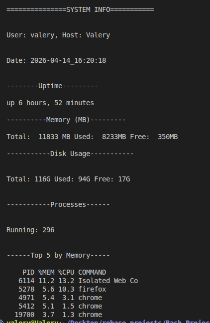

# System Information Dashboard

A terminal shell script that displays critical information about the users computer ranging from the user information to disk usage, memory and cpu processes.

## 🎯 Project Goals
-Display current user
-Display host information
-Display current date
-Show system uptime
-Provide comprehensive information about storage
-Show memory usage and heavy processes
-Display CPU usage 

## 🛠 Tech Stack
**Language**
-Bash

**Commands Used**
-awk command
-free
-df (disk free)
-$(whoami)
-uptime
-ps

## 🖥 Features

-shows current user
-system uptime
-current date and time

## 📷 Screenshots



## ⚙ Installation and Setup

Clone the repository

```bash
git clone https://github.com/swiftnathanx2/System-Info.git

cd System-Info

Add execution permissions
chmod +x sys-info.sh

**Run script**
./sys-info.sh

### 🧠 Challenges Faced

-Extracting memory usage data and formatting it properly using awk.
-Displaying CPU usage
-Using colours 

### 📚 What I learned

-How to use awk command to process text
-How to use certain flags to make text human readable

### 👨🏽‍💻 Author

Nyoh Jonathan Smith

Junior Fullstack Developer

📩Email: swiftnathan702@gmail.com

🌍 Based in Cameroon | open to remote opportunities
